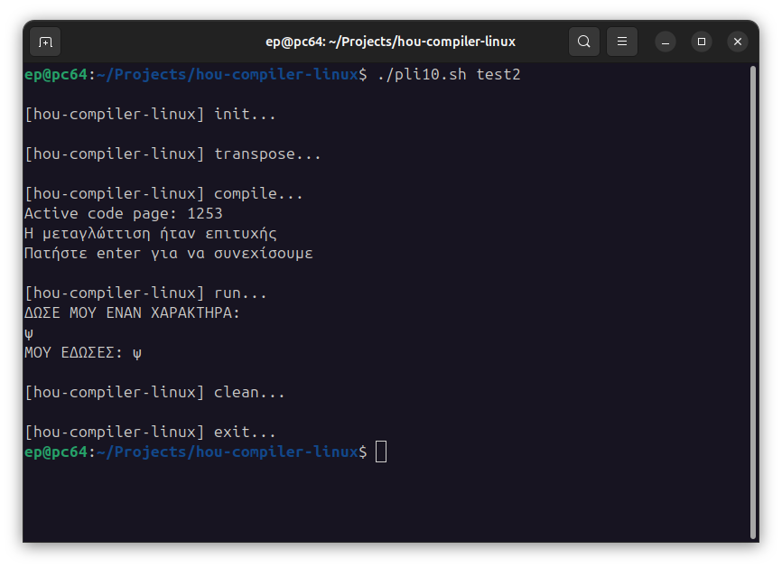

# hou-compiler-linux



## Purpose

Run Hellenic Open University's Software Engineering PLH10 compiler -finally- on Linux !

## Disclaimer

Please make sure to back up your scripts regularly and have access to a Windows machine in case this program doesn't work for you.

I take no responsibility for its use in your university or in any other way.

## Preparation

Before you use this program, please :

1. Give apropriate permissions

```
sudo chmod +x ./pli10.sh
```

2. Install Wine 32-bit

This program requires the 32-bit version of Wine.

If you are in a Debian-based OS, such as Ubuntu, Mint, Pop-OS, etc, you can easily do it by running :
```
sudo dpkg --add-architecture i386
sudo apt update
sudo apt install wine32
```

## How to Use

### 1. Create the program

Create a file -at the root of the project- named `<NAME>.utf8.eap` -  where `<NAME>` is the name you want your program to have.

For example :
```
test1.utf8.eap
```

In this file, write your code and save it.

The content must be in UTF-8 encoding (which is usually the default).

### 2. Encode, compile, run

Now, simply run `./pli10.sh <NAME>`. ( Without the `.utf8.eap` part. )

For example :
```
./pli10.sh test1
```

**This will encode\*, compile and run the program.**

❗ **Running is happening through a wrapper that handles encoding of input and output as well !**
**For optimal compatibility, don't procceed to run the produced executable your self.**

\* *By encoding, we mean converting from UTF-8 to CP1253 (Windows-1253), which is required by the legacy compiler.*

## Examples

You can find the following examples :
 - `test1.utf8.eap`
 - `test2.utf8.eap`
 - `test3.utf8.eap`

To run them :
 - `./pli10.sh test1`
 - `./pli10.sh test2`
 - `./pli10.sh test3`

## Weak Points

~~Don't use Greek characters in either the output or the input of the program. Use Greeklish instead !~~

❗ **Greek characters are now fully supported everywhere.** This is possbile thanks to the fact that the running phase is now taking place through a wrapper that takes care of input and output encodings.

## Developer Notes

 - There is a reason all files are thrown on the same place and it's because the compiler strugles generally to work with files out of it's directory.

## Changelog

(sum of [./doc/changelog.md](./doc/changelog.md))

```
## V.1.0.0:
Initial Release, simple wine wrapper.

## V.2.0.0:
Encoding compatibility support for compiling phase (converting from utf8 to CHCP1253).

## V.3.0.0:
Encoding compatibility support for running phase (buffering and converting on the fly of input and output).

## V.3.0.1:
Added preinstalled TDM-GCC which gets copied to Wine directory instead of running it's installer.
Now everything can be run fully through command line without graphics support needed.
```

## Related sources
[When is a program good ? Reverse engineering HOU’s compiler](https://blog.simplecode.gr/posts/when-is-a-program-good-reverse-engineering-hous-compiler/)
